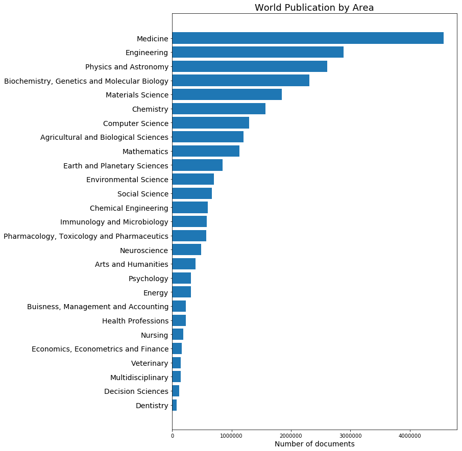
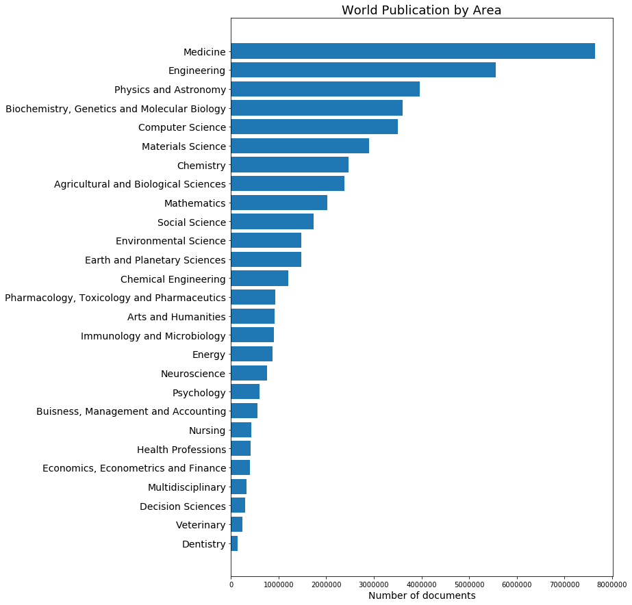
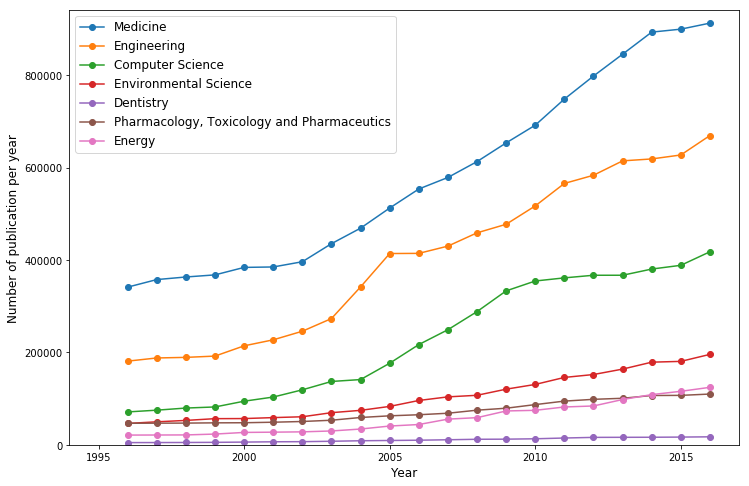
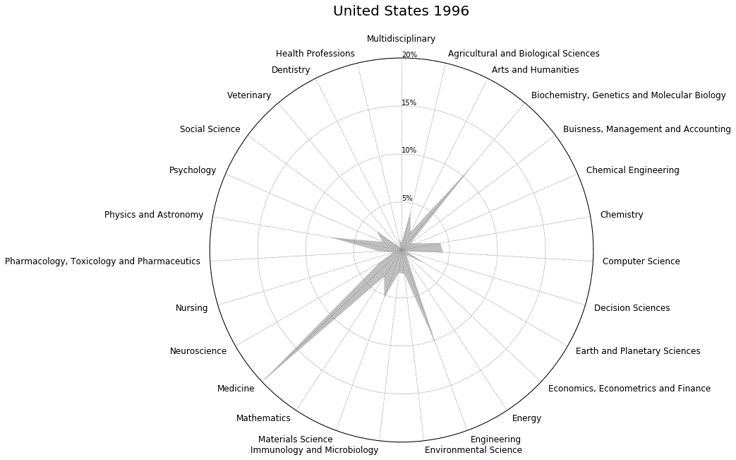
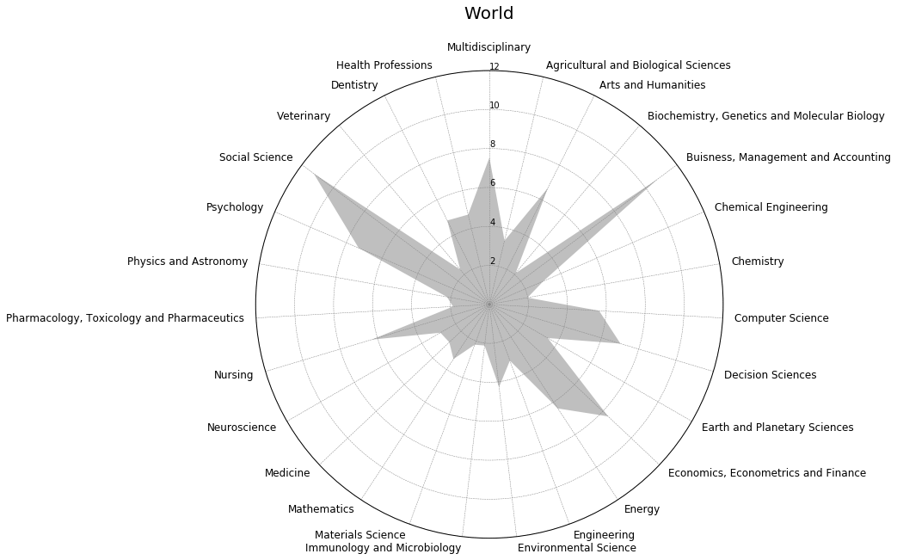

# Global Scientific Publications
This repository is a data mining project that scrape and analyzed data from the [SCImago Journal & Country Ranking dataset](http://www.scimagojr.com/countryrank.php).

The objective of this project is to analyze and visualize the change of number and trend of the publications among countries and fields for the past two decades (1996 - 2016).

## About the data source
The SCImago Journal & Country Rank is a publicly available portal that includes the journals and country scientific indicators developed from the information contained in the Scopus® database (Elsevier B.V.). 

SCImago is a research group from the Consejo Superior de Investigaciones Científicas (CSIC), University of Granada, Extremadura, Carlos III (Madrid) and Alcalá de Henares, dedicated to information analysis, representation and retrieval by means of visualisation techniques.

## Python scripts
The project use `BeautifulSoup`, `pandas`,`requests`,`numpy`,`matplotlib` and `math` packages. Please refer to the [jupyter notebook](/DataMining_visualization.ipynb)

The raw data can be obtained from the SJR website with interative dropdown menu selections. Considering the length of time and number of publicaiton areas and countries to explore and download, interacting with the website does not seem so fun, though~ So, simple steps of web scrpaing can be done by `BeautifulSoup` and `requests`. A quick example of the chunk of codes that scrapes the raw data:

```
deposit = pd.DataFrame()
for year in yr:
    for area in ar:
        url = 'http://www.scimagojr.com/countryrank.php?'+year+'&'+area
        with requests.Session() as session:
            buffer = []
            session.headers['content-type'] = 'application/json'
            response = session.get(url)
            soup = BeautifulSoup(response.content, "lxml")
            for mytable in soup.find_all('tbody'):
                for trs in mytable.find_all('tr'):
                    tds = trs.find_all('td')
                    row = [elem.text.strip() for elem in tds]
                    buffer.append(row)
            buffer = pd.DataFrame(buffer)
            buffer.drop(buffer.columns[1], axis=1, inplace = True)
            buffer.insert(0,'Year', [year[-4:]]*len(buffer))
            buffer.insert(0,'Area', [area[-4:]]*len(buffer))
        deposit = deposit.append(buffer)
```
The rest of the scripts were wrangling with scraped data. If interested, please check out the jupyter notebook file in this repository.
## The story
### What are the hot topics in research publications? 
Here are the contrast between the two decades (1996-2006 vs. 2007-2016).



There are some changes in the ranking of total number of publications by areas between the two decades, of course. Not surprising, with the continued prosperity of information technology and whole lot of internet-based buisness and applications, publications related to computer science was catching up pretty fast. However, some of the traditionally "publication heavy" areas such as medicine, engineering and physics remained on top of the ranking

### How about the trend?
Again, not suprising that the number of publications in each field has been steadily increasing, even veterinery, which was at the bottom of the "hot topic" list.



### Another field of competition for big countries?
Scientific publications are not full reprensentation of the level of science and technology research, but to large extent, they suggest the investment and dedication of a country to fundamental and applied research. 
The United States has been the absolute leading force in the number of publications of every field. If we just compare the total number of publications for the past two decades, the US published as many research articles as the sum of China, the United Kingdom and Germany. However, this is slowly changing. China picked up the pace and is rapid catching up with the US in many areas *See below: number of the publications by country in 1996(left) and 2016(right))*


### Shape of research

I call it "shape of research" because by looking at the number of publications in various fields would give us a rough idea of how a country is dedicating its major efforts to. For example, we see from the plot above that medicine research is very likely a major part of the research endeavors of the US. It remained so for the past twenty years despite the boom in the IT area. In contrast, China, another major contributor with growing roles in the research publications, start off with focuses on basic disciplines such as engineering, material science, physics and chemistry in 1996, but has gradually stepped more into the areas like neuroscience, medicine, computer sciences etc.

However, we should also be cautious not to over-interpret the pattern. A confounding fact would be that some areas (more research-oriented, if you will) are likely to have more publications compared to areas that are more practical. For example, scientists in the area of medicine research normally announce their research findings via scientific papers, whereas engineers may choose to register their achievements as patents besides describing them in papers.

### Changing as a world


From the above discussion we might have the impression that engineering, medicine or natural sciences have claimed the majority of the increase in publications. It may be true but not 100 percent. If we take a look at the increase of number of publications by area relative to the 1996 level, we would be surprised to find out that non-STEM fields (namely business, social sciences, psychology etc.) take the lead. 

### Number vs. citation
We all realize that the number of publications does not tell the whole story. The number of citations of a publication shows the impact of an article. The SJR dataset provided us this number by area, country and year as well. 

The scatter plot below shows number of citations vs. number of publications by country. Interestingly, we could visually identify two "branches". Countries in the first branch generally have (comparably) higher number of citations vs. publications. Most developed countries are in this group. In contrast, the second branch, consisting of countries mostly from the third world (e.g. China and India) have lower citation-to-publication ratio. This could mean two things:
1. The number of citations is not a static number. As these countries are publishing more papers only in recent years, we could anticipate the citation-to-publication ratio to change with time.
2. The level of recognition for these research outcomes from these countries have not yet been comparable to that of the developed countries. This could also be partially supported by the high percentage of self-citation (citations that come from authors who were also involved in the cited article).


_**If you would like to learn more about the analysis or would like to check out the Python codes to explore more, do not hestiate to fork the scripts. Of course, any comments (coding, analysis, interpretation, anything) would be greatlt appreciated!**_
